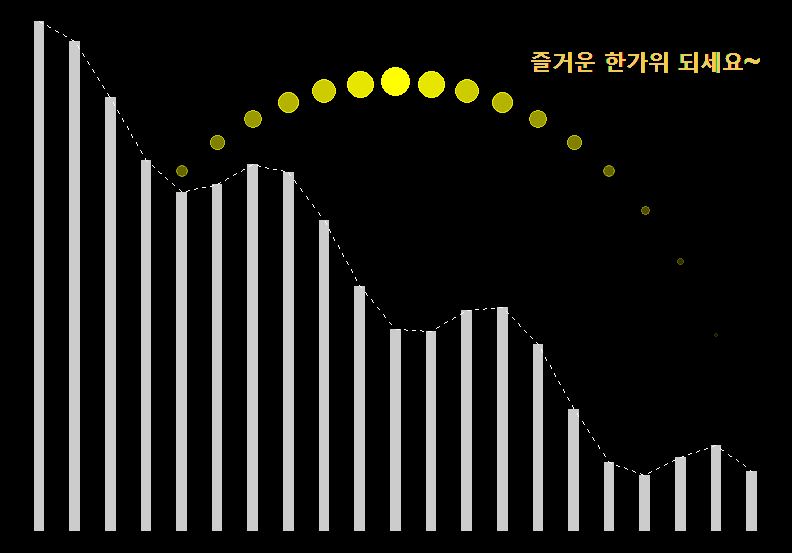

Q) 즐거운 한가위! 주어진 데이터를 이용하여 운치있는 달과 산세를 그려주세요~



```{r, message=FALSE, warning=FALSE, include=FALSE}
library(dplyr)
library(data.table)
library(ggplot2)

r <- 10
x <- -r:r

data <- data.frame(x=x, y=sqrt(r^2-(x)^2))
```