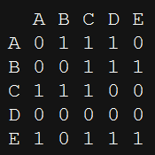
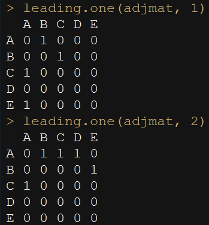
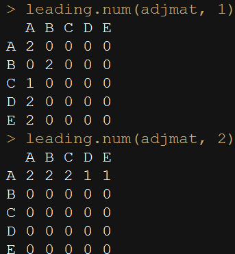

Q1) 주어진 데이터를 이용하여 다음 그림처럼 행 혹은 열마다  
**처음 등장하는 숫자 1만 남기는 함수** leading.one 을 작성해주세요   
> hints : t, apply, cummax, diff, ifelse

```{r, message=FALSE, warning=FALSE, include=FALSE}
set.seed(171111)

gen.mat <- function(dim, min=0, max=1){
  mat <- matrix(sample(min:max, dim^2, replace=TRUE), dim)
  rownames(mat) <- LETTERS[1:dim]
  colnames(mat) <- LETTERS[1:dim]
  mat
}

(adjmat <- gen.mat(dim=5))
```
  
  

Q2) 앞서 만든 leading.one 함수를 이용하여 행 혹은 열마다  
**처음 등장하는 0이 아닌 숫자만 남기는 함수** leading.num 을 작성해주세요  

```{r, message=FALSE, warning=FALSE, include=FALSE}
(adjmat <- gen.mat(dim=5, min=0, max=2))
```
  
  
