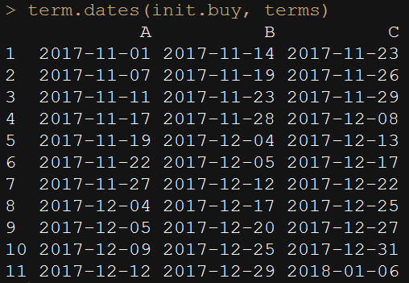

Q) 초기날짜값과 다음 구매까지 걸린 일수(day)를 이용하여 
첨부 그림과 같은 yyyy-MM-dd 형태로 표현하는 함수를 작성해주세요 

> hint : class, unclass, apply

```{r}
set.seed(171124)

buy.term <- function(n) floor(rgamma(n,5,1))

terms <- matrix(buy.term(30), 10, 3)
colnames(terms) <- LETTERS[1:3]

(init.buy <- c('2017-11-01','2017-11-14','2017-11-23'))
terms
```


