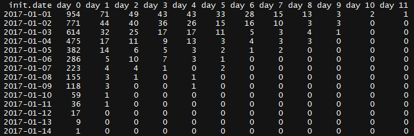

Q) 주어진 고객별 구매일자 데이터를 이용하여 그림과 같은 최초구매일별 고객 잔류표를 출력해주세요


> hints : diff, difftime, dcast

```{r, message=FALSE, warning=FALSE, include=FALSE}
library(dplyr)
library(data.table)

set.seed(171209)

rdate <- function(n=1, from=Sys.Date()-365*1, to=Sys.Date()){
  interval <- difftime(round(to), round(from))
  rday <- rbeta(n, 1, 3) * interval
  from + floor(rday)
}

rstr <- function(n=1, str.len=1) {
  rn <- runif(str.len * n, 1, 24)
  df <- as.data.frame(matrix(rn, str.len, n))
  num.to.str <- function(v) paste0(LETTERS[v], collapse='')
  res <- sapply(df, num.to.str)
  names(res) <- NULL
  res
}

n <- 5000

raw.data <-
  data.frame(
    user.id = rstr(n,3),
    buy.date = rdate(n, from=as.Date('2017-01-01'), to=as.Date('2017-01-15'))) %>% 
  distinct %>%
  arrange(user.id, buy.date)
```

