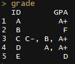

Q) 주어진 데이터셋의 학생별 성적이력을 unstack 하는 함수 unstack.col을 작성해주세요~  
> **필수 요건 :**  
> R 기본제공 함수만 이용해야합니다  
> `for` 구문은 사용할 수 없습니다  

```{r, message=FALSE, warning=FALSE, include=FALSE}
grade <- 
  as.data.frame(cbind(
    ID = c(LETTERS[1:5]),
    GPA = list('A+','F', c('C-','B','A+'), c('A','A+'), 'D')
  ))
```

  

