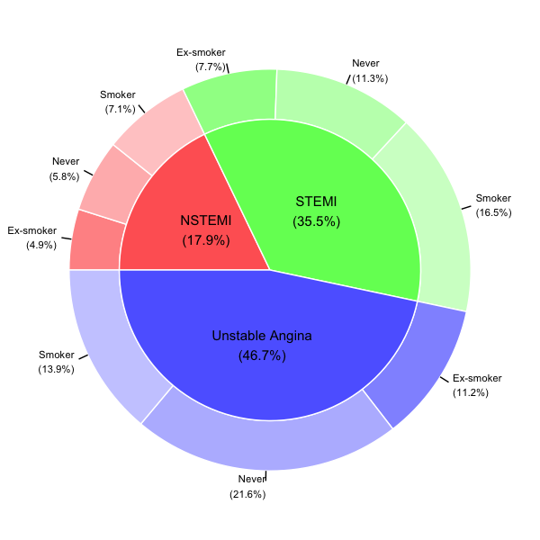

```{r setup, include=FALSE}
knitr::opts_chunk$set(echo = TRUE,comment=NA)
```

## 기존의 PieDonut Plot

오랜만에 찾아오는 Weekly quiz입니다. 오늘의 문제는 제가 만든  moonBook 패키지의 acs데이터를 이용한 PieDonut Plot입니다. 먼저 제가 만든 ggiraphExtra 패키지의  ggPieDonut() 함수를 쓰면 다음과 같은 PieDonut Plot을 쉽게 만들수 있습니다.

```{r,eval=FALSE}
library(ggplot2)
library(ggiraph)
library(ggiraphExtra)
library(moonBook)

ggPieDonut(acs,aes(pies=Dx,donuts=smoking))
```


## 오늘의 문제

오늘의 문제는 PieDonut Plot을 발전시켜 Pie의 일부를 튀어나오게 해서 강조하는 것입니다. 다음 그림을 참조하세요


