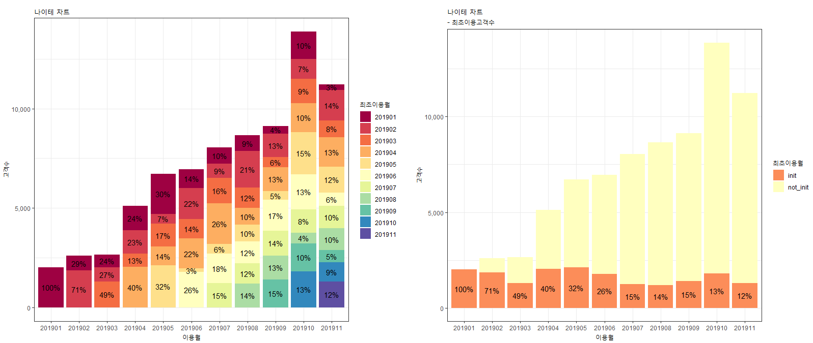

Q) 첨부 그림과 같은 나이테 차트를 그려주세요!  

X축 : 서비스 이용월  
Y축 : 고객수  
범례-색상 : 최초서비스이용월 코호트  

```{r}
library(dplyr)
library(ggplot2)
library(gridExtra)

set.seed(20191205)

init <- c('201901','201902','201903','201904','201905','201906','201907','201908','201909','201910','201911')
after <- rep(init, times=1, each=11)

month.gap <- function(y1, m1, y0, m0) 12*(y1 - y0) + (m1 - m0)

data <-
  cbind(init, after) %>%
  as.data.frame %>%
  arrange(init) %>%
  mutate(
    init_year = as.numeric(substring(init, 1, 4)),
    init_month = as.numeric(substring(init, 5, 6)),
    after_year = as.numeric(substring(after, 1, 4)),
    after_month = as.numeric(substring(after, 5, 6)),
    month_gap = month.gap(after_year, after_month, init_year, init_month)) %>%
  filter(month_gap >= 0) %>%
  mutate(user_count = abs(floor(rnorm(n(), 0, 5)*100 + 1000)))
```


