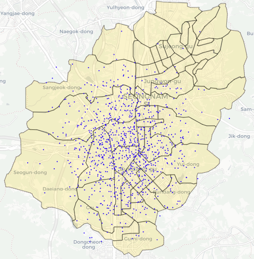

Q) 각 polygon 에 겹치는 point 수를 count 후 첨부 파일과 같이 시각화 해주세요!
  
> 행정동 정보(= polygon) 출처 : https://github.com/vuski/admdongkor
  
---
  
 
 

---

```{r}
library(sf)
library(dplyr)
library(leaflet)
library(mapview)

rm(list=ls())

points <- readRDS('points.RDS')
polygons <- readRDS('polygons.RDS')

leaflet() %>%
  addProviderTiles(providers$CartoDB.Positron) %>%
  addPolygons(data=polygons, color='black', weight=1, fillColor='gold', fillOpacity=.2) %>%
  addCircles(data=points, color=NA, weight=5, fillColor='blue', fillOpacity=1)
```