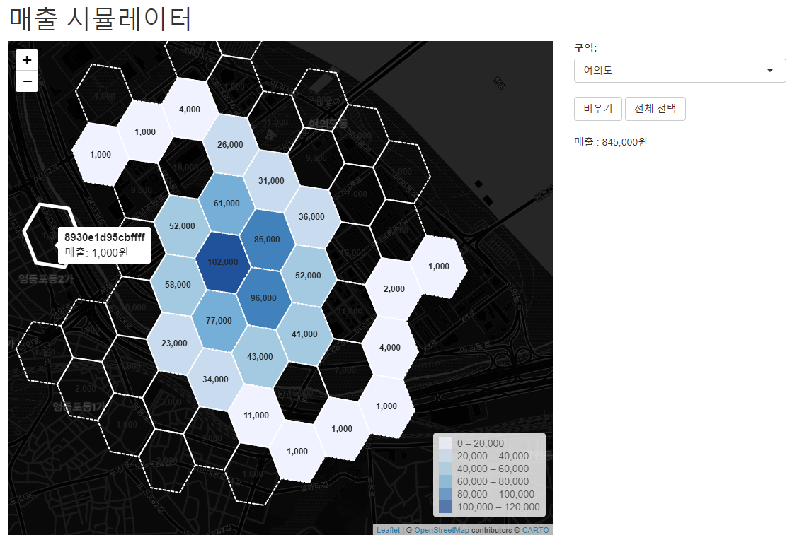

Q) 다음 동영상과 같은 매출 시뮬레이터를 만들어 주세요
  
> 조건 :
  
- '구역' 의 드롭다운 메뉴를 선택하면 해당 구역의 모든 지역이 선택(=색이 차있는 H3 육각형)됩니다  
- 우측에 '매출 : 1,000,000원' 과 같이 표기되는 매출은 선택된 모든 지역 매출의 합계입니다 (= 매출 총합)
- 선택된 지역은 색이 차있고, 선택되지 않은 지역은 색이 비어있습니다 (즉시 적용)
- 선택된 지역을 클릭하면 선택이 풀리고, 선택되지 않은 지역을 클릭하면 선택됩니다
- '비우기' 버튼을 누르면 모든 지역의 선택이 풀립니다
- '전체 선택' 버튼을 누르면 모든 지역이 선택됩니다
- 사용자의 맵 이동, 줌 레벨은 유지되어야합니다
- 다만 예외적으로 '구역' 을 변경하는 경우는 사용자의 맵 이동, 줌 레벨이 초기화됩니다

---
  
 
 

---
  
```{r}
library(dplyr)
library(sf)
library(shiny)
library(leaflet)
library(htmltools)
library(scales)

rm(list=ls())

yeoeuido <- readRDS('yeoeuido.RDS') 
paldalmun <- readRDS('paldalmun.RDS') 

ui <- fluidPage(
  h1('매출 시뮬레이터'),
  fluidRow(
    column(7, leafletOutput('map', height='800px')),
    column(3, 
           selectInput('region', '구역:', c('여의도'=1, '팔달문'=2)),
           actionButton('clear', '비우기'),
           actionButton('all', '전체 선택'),
           h3(''),
           textOutput('revenue')
    )
  )
)

server <- function(input, output){
  
}

shinyApp(ui, server)
```
