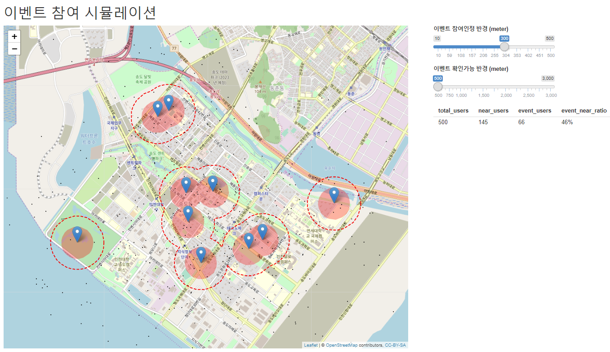

Q) O2O(=Online to Offline) 이벤트 참여율을 시뮬레이션하는 샤이니 앱을 작성해주세요!  
  
> 조건 :
  
- 이용자의 서비스 이용완료 위치가 이벤트 장소에 해당하면 경품을 제공합니다  
- markers.RDS 는 오프라인 이벤트 장소, users.RDS 는 사용자들의 이용완료 위치를 담고 있습니다  
- 이벤트 장소와 사용자의 거리가 너무 멀면 이벤트 참여가 현실적으로 어렵습니다  
- 따라서 이벤트 참여가능 거리 내의 사용자들만을 한정하여 이벤트 참여율을 확인하고자합니다  
- 첨부 동영상과 같이 슬라이드를 조절하여 이벤트 참여율을 계산하는 샤이니 앱을 만들어주세요  

---
  
 
> 어플리케이션 영상 : `o2o_event_simulation_result.mp4` 참조 

---

```{r}
library(leaflet)
library(shiny)
library(sf)
library(dplyr)
library(scales)

rm(list=ls())

ui <- fluidPage(
  h1('이벤트 참여 시뮬레이션'),
  fluidRow(
    column(8, leafletOutput('map', width='1000px', height='800px')),
    column(4, 
      sliderInput('in_radius', label='이벤트 참여인정 반경 (meter)', min=10, max=500, value=300),
      sliderInput('near_radius', label='이벤트 참여가능 반경 (meter)', min=500, max=3000, value=500),
      tableOutput('table'))
  )
)

server <- function(input, output){

  markers <- readRDS('markers.RDS')
  users <- readRDS('users.RDS')
  
  # make map
  output$map <- renderLeaflet({

  })
  
  # make table
  output$table <- renderTable({

  })
}

shinyApp(ui, server)
```
