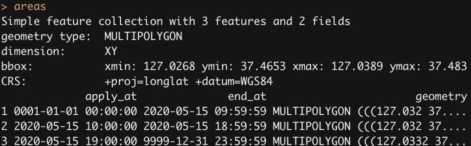
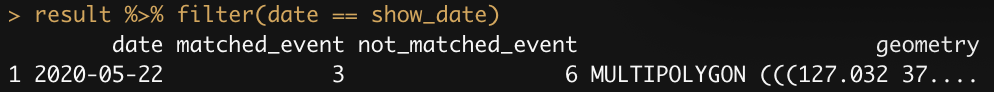
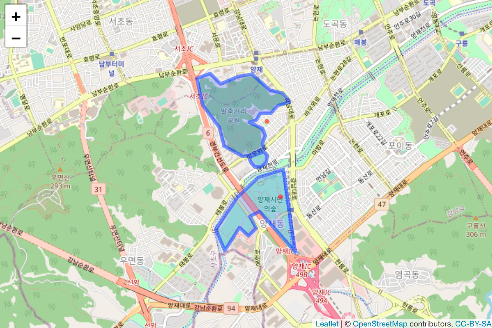

Q) 이벤트 구역 내에서 발생한 이벤트 수를 집계해주는 함수 daily_matched_points 를 구현해주세요!  
- 입력값으로 다음 4가지 내역을 받습니다 : 이벤트 구역, 이벤트 발생이력, 집계시작일, 집계종료일  
- 이벤트 구역은 시간에 따라 변화하였으며 그 이력은 areas 에 기록되었습니다  
- 이벤트 발생이력은 points 에 기록되었습니다  
- 집계시작일, 집계종료일은 '%Y-%m-%d' format의 character 로 받습니다  

```{r, message=FALSE, warning=FALSE}
library(dplyr)
library(sf)
library(leaflet)

rm(list=ls())

# all geospatial objects are made by 'geodrawr' package
# install.packages('geodrawr')

base_crs <- '+proj=longlat +datum=WGS84'
base_datetime_format <- '%Y-%m-%d %H:%M:%S'

date_to_time <- function(date, time) {
  paste(date, time) %>%
    strptime(format=base_datetime_format, tz='UTC') %>%
    as.POSIXct
}

init_at <- date_to_time('2020-05-15', '00:00:00')

event_area_01 <- readRDS('event_area_01.rds') %>% st_multipolygon %>% st_sfc
event_area_02 <- readRDS('event_area_02.rds') %>% st_multipolygon %>% st_sfc
event_area_03 <- readRDS('event_area_03.rds') %>% st_multipolygon %>% st_sfc

areas <- 
  data.frame(
    apply_at = init_at + c(0 + 1*60*60, 0 + 10*60*60, 0 + 19*60*60),
    geometry = c(event_area_01, event_area_02, event_area_03))

areas[1,1] <- NA
areas <-
  areas %>%
  transmute(
    apply_at, 
    end_at = lead(apply_at, 1) - 1,
    apply_at = coalesce(apply_at, date_to_time('0001-01-01','00:00:00')),
    end_at = coalesce(end_at, date_to_time('9999-12-31','23:59:59')),
    geometry) %>%
  st_sf(crs=base_crs)

areas
```
  

```{r, message=FALSE, warning=FALSE}
set.seed(20200712)

points <- 
  readRDS('events.rds') %>% 
  st_sf(crs=base_crs) %>% 
  transmute(occur_at = init_at + 24*60*sample(x=0:60, size=n(), rep=TRUE)) %>%
  arrange(occur_at)
  
points
```
  

```
daily_matched_points <- function(areas, points, from_date, to_date){

}

result <- daily_matched_points(areas, points, '2020-05-13', '2020-05-17')

show_date = '2020-05-16'

leaflet() %>%
  addTiles %>%
  addPolygons(data=result %>% filter(date == show_date) %>% st_sf(crs=base_crs)) %>%
  addCircles(data=points %>% filter(as.Date(occur_at) == as.Date(show_date)), color='red')
```
  

```
result %>% filter(date == show_date)
```
  