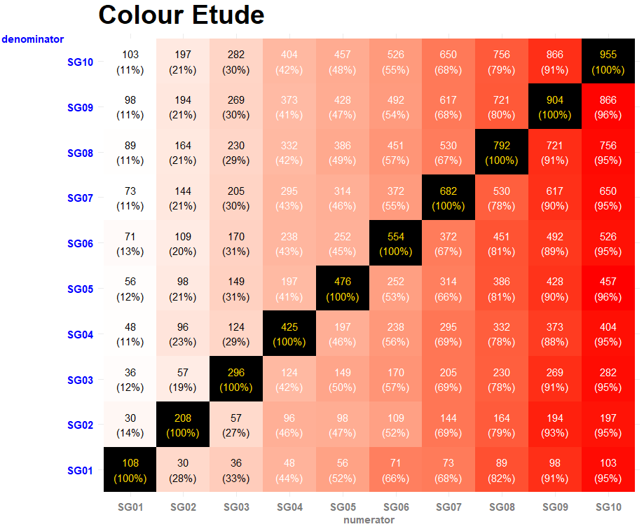

Q) 예전에 만들었던 이용자 세그먼트 교차비중 차트를 수정해달라는 요청이 들어왔습니다!  

불만사항은 다음과 같습니다
- 교차비중의 높고 낮음을 색상으로 파악하는데 분모=분자인 대각의 100% 부분 때문에 헷갈립니다  
- 내부 글씨는 전부 흰색으로 같은데 타일 색은 그라데이션으로 달라져 보기 힘듭니다  
- 어차피 0%~100% 라서 범례는 없애는 게 좋을 것 같네요   
- 분모축과 분자축의 색상을 다르게 하면 낫겠어요  
- 제목과 축은 크기를 키워 강조해주세요  

불만사항을 해결하여 다음과 같은 차트로 완성해주세요!  

### 불만사항 해결 차트
  

### 예전 차트
  

```{r, message=FALSE, warning=FALSE}
library(dplyr)
library(tidyr)
library(ggplot2)
library(scales)

rm(list=ls())

set.seed(20191210)

n <- 10^3

input <- 
  data.frame(
    id=1:n,
    SG01=sample(x=c(0, 1), size=n, replace=TRUE, prob=c(.9, .1)),
    SG02=sample(x=c(0, 1), size=n, replace=TRUE, prob=c(.8, .2)),
    SG03=sample(x=c(0, 1), size=n, replace=TRUE, prob=c(.7, .3)),
    SG04=sample(x=c(0, 1), size=n, replace=TRUE, prob=c(.6, .4)),
    SG05=sample(x=c(0, 1), size=n, replace=TRUE, prob=c(.5, .5)),
    SG06=sample(x=c(0, 1), size=n, replace=TRUE, prob=c(.4, .6)),
    SG07=sample(x=c(0, 1), size=n, replace=TRUE, prob=c(.3, .7)),
    SG08=sample(x=c(0, 1), size=n, replace=TRUE, prob=c(.2, .8)),
    SG09=sample(x=c(0, 1), size=n, replace=TRUE, prob=c(.1, .9)),
    SG10=sample(x=c(0, 1), size=n, replace=TRUE, prob=c(.05, .95))
  )

segments.view <- function(df){
  base.data <-
    df %>% 
    gather('var', 'value', -id) %>%
    filter(value != 0) %>%
    select(-value)
  
  wide.data <-
    base.data %>%
    inner_join(base.data, by='id') %>%
    group_by(var.x, var.y) %>%
    summarise(user_count = length(unique(id))) %>%
    spread(var.y, user_count)
  
  wide.data[is.na(wide.data)] <- 0
  
  wide.data.matrix <- 
    wide.data[,-1] %>% as.matrix
  
  denominators <- 
    wide.data.matrix %>% diag
  
  wide.data.ratio <-
    wide.data.matrix %>% 
    '/'(., denominators) %>%
    data.frame(var.x = wide.data[,1], .)
  
  long.data.ratio <-
    wide.data.ratio %>%
    gather('var.y', 'ratio', -var.x)
  
  long.data <-
    wide.data %>%
    gather('var.y', 'user_count', -var.x)
  
  long.data %>%
    inner_join(long.data.ratio, by=c('var.x','var.y')) %>%
    ungroup %>%
    transmute(
      denominator = var.x,
      numerator = var.y,
      user_count,
      ratio
    ) %>%
    arrange(
      denominator, 
      numerator
    )
}

output <- segments.view(input)

# 예전 차트
output %>%
  mutate(label_text = paste(comma(user_count, 1), '\n(', percent(ratio, 1), ')', sep='')) %>%
  ggplot(aes(x=numerator, y=denominator, fill=ratio)) +
  geom_tile() +
  geom_text(aes(label=label_text), color='white') +
  scale_fill_gradient(low='white', high='red', label=percent) +
  theme_minimal() +
  theme(axis.title.y = element_text(angle=0)) +
  labs(title='colour etude', y='denominator', x='numerator')
```
