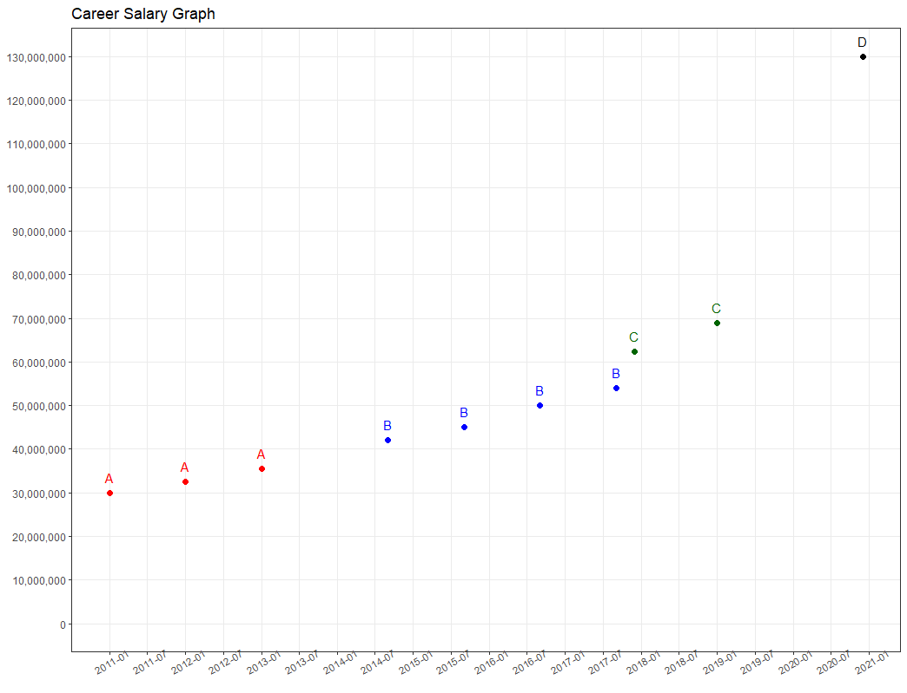

Q) 주어진 연봉테이블 기준으로 테이블을 콘솔 출력하고 차트를 그려주는 함수 career_salary_graph 를 작성해주세요!  

---
  
 
 

---

```{r}
library(dplyr)
library(tidyr)
library(scales)
library(ggplot2)

rm(list=ls())

sample_01 <- tribble(
  ~date, ~corp, ~salary,
  '2015-01', 'A', 45000000,
  '2016-01', 'A', 46000000,
  '2017-01', 'A', 47000000,
  '2017-07', 'B', 60000000,
  '2018-01', 'B', 63000000,
  '2019-01', 'B', 66000000
)

sample_02 <- tribble(
  ~date, ~corp, ~salary,
  '2011-01', 'A', 30000000,
  '2012-01', 'A', 32500000,
  '2013-01', 'A', 35500000,
  '2014-09', 'B', 42000000,
  '2015-09', 'B', 45000000,
  '2016-09', 'B', 50000000,
  '2017-09', 'B', 54000000,
  '2017-12', 'C', 60000000 + 2400000,
  '2019-01', 'C', 65000000 + 4000000,
  '2020-12', 'D', 100000000 + 30000000
)

career_salary_graph <- function(input_table, corp_color, date_ticks='6 months', salary_ticks=5*10^6){

}

career_salary_graph(sample_01, corp_color=c('blue','gray30'), date_tick='3 months')
career_salary_graph(sample_02, corp_color=c('red','blue','dark green','black'), salary_tick=10^7)

```