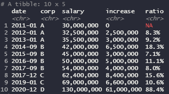

Q) 주어진 json 컬럼을 풀어 data.frame 으로 이어붙여주는 함수 unnest_json_col 함수를 만들어주세요!  

---
  
 

---

```{r}
library(dplyr)
library(tibble)
library(rjson)

rm(list=ls())

data = tribble(
  ~session, ~json,
  'A', '{"Unit":["Marine","Medic","Tank"],"Action":"Move"}',
  'B', '{"Unit":["Marine","Medic","Tank"],"Action":"Attack","Target":"Zealot"}',
  'C', '{"Unit":["Medic"],"Action":"Heal","Target":["Marine","Ghost","Marine"]}',
  'D', '{"Unit":["SCV"],"Action":"Repair","Target":["Tank"]}'
) %>% as.data.frame

unnest_json_col = function(df, col){
  json_col = df[, col]
  other_col = df[, -col, drop=FALSE]
  res = data.frame()
  suppressWarnings({
    for(i in 1:nrow(df)){
      json_elem = json_col[i]
      other_row = other_col[i, , drop=FALSE]
      r = cbind(other_row, json_to_df(json_elem))
      res = rbind(res, r)
    }
  })
  res
}

unnest_json_col(data, 2)
```