<div align="center">

</div>

# R Korea Weekly Quiz


R Korea에서 진행한 주말맞이 R Quiz 모음입니다.


Table of Contents
=======================

* [2017 년](#2017-년)
   * [9 월](#9-월)
   * [10 월](#10-월)
   * [11 월](#11-월)
   * [12 월](#12-월)
* [2018 년](#2018-년)
   * [1 월](#1-월)
   * [2 월](#2-월)
   * [3 월](#3-월)
   * [4 월](#4-월)
   * [6 월](#6-월)
   * [8 월](#8-월)
   * [10 월](#10-월-1)
   * [11 월](#11-월-1)
* [2019 년](#2019-년)
   * [11 월](#11-월-2)
   * [12 월](#12-월-1)
* [2020 년](#2020-년)
   * [1 월](#1-월-1)
   * [2 월](#2-월-1)
   * [3 월](#3-월-1)
   * [4 월](#4-월-1)
   * [5 월](#5-월)
   * [7 월](#7-월)
   * [8 월](#8-월-1)
   * [10 월](#10-월-2)
   * [11 월](#11-월-3)
   * [12 월](#12-월-2)
* [2021 년](#2021-년)
   * [3 월](#3-월-2)
   * [4 월](#4-월-2)
   * [9 월](#9-월-1)

## 2017 년
### 9 월
<details><summary>1. heatmap</summary>
    
<a href="./201709/1.heatmap/heatmap_quiz.md" target="_blank">문제 바로 가기</a>

<div>Q) 주어진 데이터를 이용해서 차트를 그려주세요 :)</div>
    
<div align="center">
  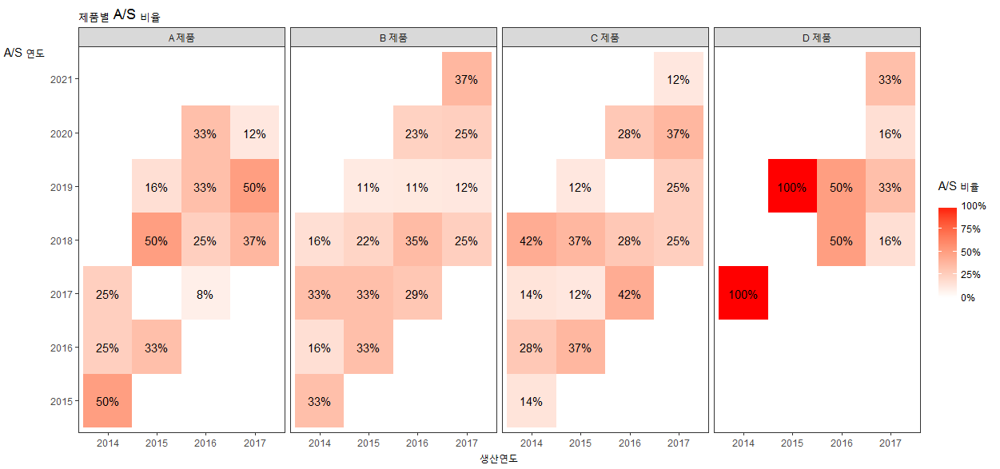
</div>

<a href="./201709/1.heatmap/heatmap_answer.R" target="_blank">정답 보기</a>
</details>

<details><summary>2. waterfall</summary>
    
<a href="./201709/2.waterfall/waterfall_quiz.md" target="_blank">문제 바로 가기</a>

<div>Q) 주어진 데이터를 이용해서 차트를 그려주세요 :)</div>
    
<div align="center">
  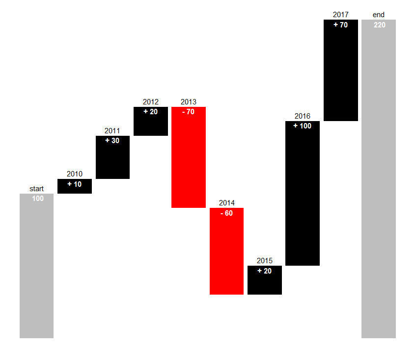
</div>

<a href="./201709/2.waterfall/waterfall_answer.R" target="_blank">정답 보기</a>
</details>

<details><summary>3. hangawui</summary>
    
<a href="./201709/3.hangawui/hangawui_quiz.md" target="_blank">문제 바로 가기</a>

<div>Q) 즐거운 한가위! 운치있는 달과 별들 그리고 산을 자유롭게 그려주세요~</div>
    
<div align="center">
  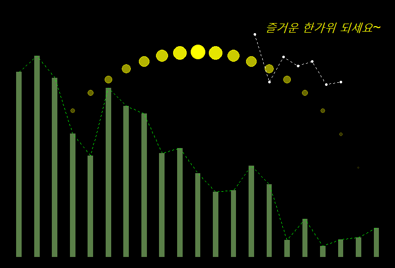
</div>

<a href="./201709/3.hangawui/hangawui_answer.R" target="_blank">정답 보기</a>
</details>

### 10 월
<details><summary>1. monotonic</summary>
    
<a href="./201710/1.monotonic/monotonic_quiz.md" target="_blank">문제 바로 가기</a>

<div>Q) 단조감소인 경우 1 아닌 경우 0 으로 표시해주세요</div>
    
<div align="center">
  
</div>

<a href="./201710/1.monotonic/monotonic_answer.R" target="_blank">정답 보기</a>
</details>

<details><summary>2. word_pivot</summary>
    
<a href="./201710/2.word_pivot/word_pivot_quiz.md" target="_blank">문제 바로 가기</a>

<div>Q) 주어진 데이터를 이용하여 다음 그림처럼 변형해주세요</div>
    
<div align="center">
  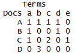
</div>

<a href="./201710/2.word_pivot/word_pivot_answer.R" target="_blank">정답 보기</a>
</details>

### 11 월
<details><summary>1. leading_one</summary>
    
<a href="./201711/1.leading_one/leading_one_quiz.md" target="_blank">문제 바로 가기</a>

<div>Q1) 주어진 0과 1로 구성된 데이터를 이용하여 다음 그림처럼 행 혹은 열마다</div>
    
<div align="center">
  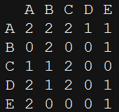
</div>

<a href="./201711/1.leading_one/leading_one_answer.R" target="_blank">정답 보기</a>
</details>

<details><summary>2. reorder_target_color</summary>
    
<a href="./201711/2.reorder_target_color/reorder_target_color_quiz.md" target="_blank">문제 바로 가기</a>

<div>Q) 기본 데이터셋인 mtcars를 이용하여 다음 차트를 그려주세요</div>
    
<div align="center">
  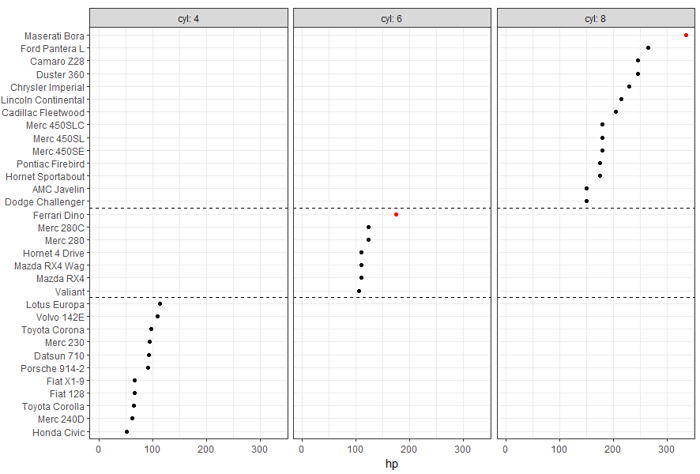
</div>

<a href="./201711/2.reorder_target_color/reorder_target_color_answer.R" target="_blank">정답 보기</a>
</details>

<details><summary>3. simple_date_handling</summary>
    
<a href="./201711/3.simple_date_handling/simple_date_handling_quiz.md" target="_blank">문제 바로 가기</a>

<div>Q) 고객별 초기날짜값(= init.buy) 및 다음 구매까지 걸린 일수(= terms)를 이용하여</div>
    
<div align="center">
  
</div>

<a href="./201711/3.simple_date_handling/simple_date_handling_answer.R" target="_blank">정답 보기</a>
</details>

### 12 월
<details><summary>1. retension</summary>
    
<a href="./201712/1.retension/retension_quiz.md" target="_blank">문제 바로 가기</a>

<div>Q) 주어진 고객별 구매일자 데이터를 이용하여 그림과 같은 최초구매일별 고객 잔류표를 출력해주세요</div>
    
<div align="center">
  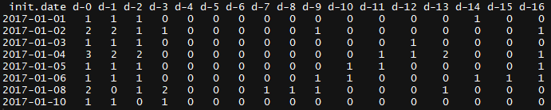
</div>

<a href="./201712/1.retension/retension_answer.R" target="_blank">정답 보기</a>
</details>

<details><summary>2. daily_purchase_by_group</summary>
    
<a href="./201712/2.daily_purchase_by_group/daily_purchase_by_group_quiz.md" target="_blank">문제 바로 가기</a>

<div>Q) 주어진 구매 데이터를 이용하여 그림과 같은 그룹 별 구매율 & 취소율 daily chart를 그려주세요</div>
    
<div align="center">
  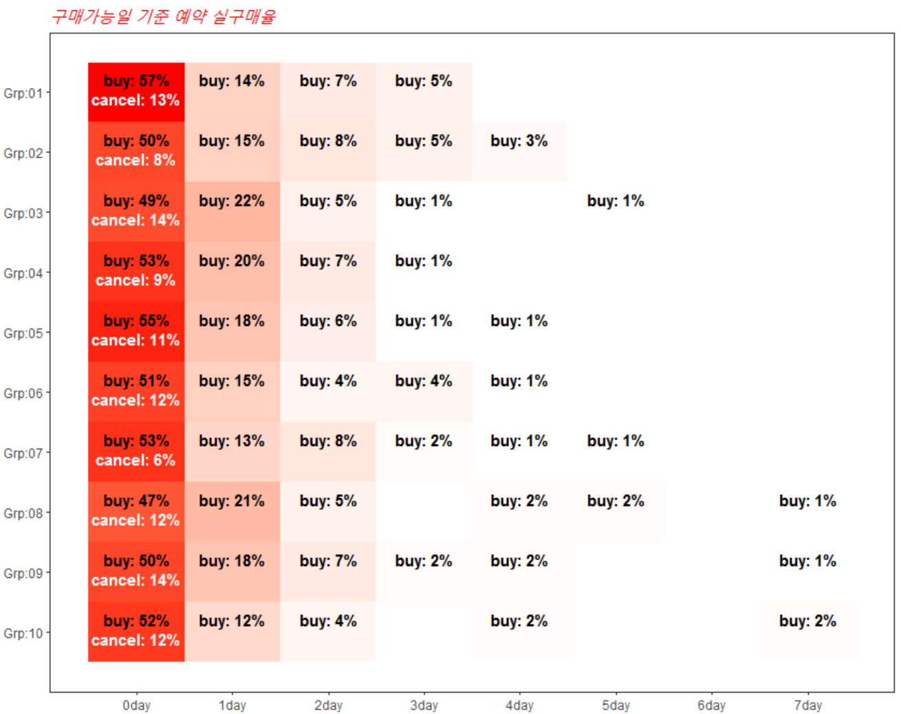
</div>

<a href="./201712/2.daily_purchase_by_group/daily_purchase_by_group_answer.R" target="_blank">정답 보기</a>
</details>

<details><summary>3. radar</summary>
    
<a href="./201712/3.radar/radar_quiz.md" target="_blank">문제 바로 가기</a>

<div>Q) 기본 데이터셋인 mtcars를 이용하여 다음과 같은 0~1 스케일 레이더 차트를 그려주세요</div>
    
<div align="center">
  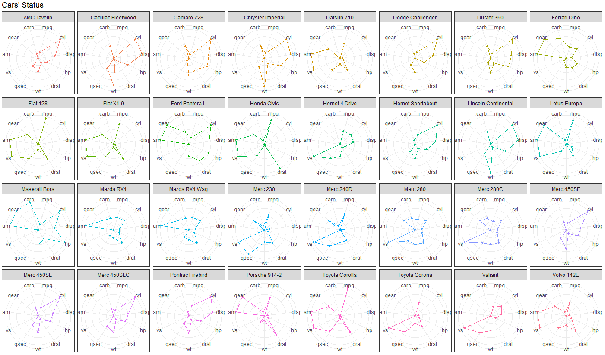
</div>

<a href="./201712/3.radar/radar_answer.R" target="_blank">정답 보기</a>
</details>

## 2018 년
### 1 월
<details><summary>1. unstack_column</summary>
    
<a href="./201801/1.unstack_column/unstack_column_quiz.md" target="_blank">문제 바로 가기</a>

<div>Q) 주어진 데이터셋의 학생별 성적이력을 unstack 하는 함수 unstack.col을 작성해주세요~</div>
    
<div align="center">
  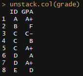
</div>

<a href="./201801/1.unstack_column/unstack_column_answer.R" target="_blank">정답 보기</a>
</details>

<details><summary>2. number_baseball</summary>
    
<a href="./201801/2.number_baseball/number_baseball_quiz.md" target="_blank">문제 바로 가기</a>

<div>Q) 숫자야구 게임을 만들어주세요!</div>
    
<div align="center">
  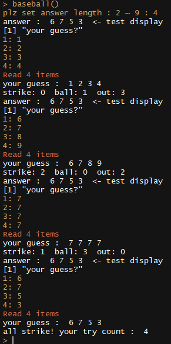
</div>

<a href="./201801/2.number_baseball/number_baseball_answer.R" target="_blank">정답 보기</a>
</details>

### 2 월
<details><summary>1. purchase_chain</summary>
    
<a href="./201802/1.purchase_chain/purchase_chain_quiz.md" target="_blank">문제 바로 가기</a>

<div>Q) 데이터 분석을 위한 전처리를 해주세요!</div>
    
<div align="center">
  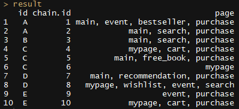
</div>

<a href="./201802/1.purchase_chain/purchase_chain_answer.R" target="_blank">정답 보기</a>
</details>

<details><summary>2. moving_average</summary>
    
<a href="./201802/2.moving_average/moving_average_quiz.md" target="_blank">문제 바로 가기</a>

<div>Q) 주어진 데이터를 이용하여 3개월 이동평균 차트를 그려주세요!</div>
    
<div align="center">
  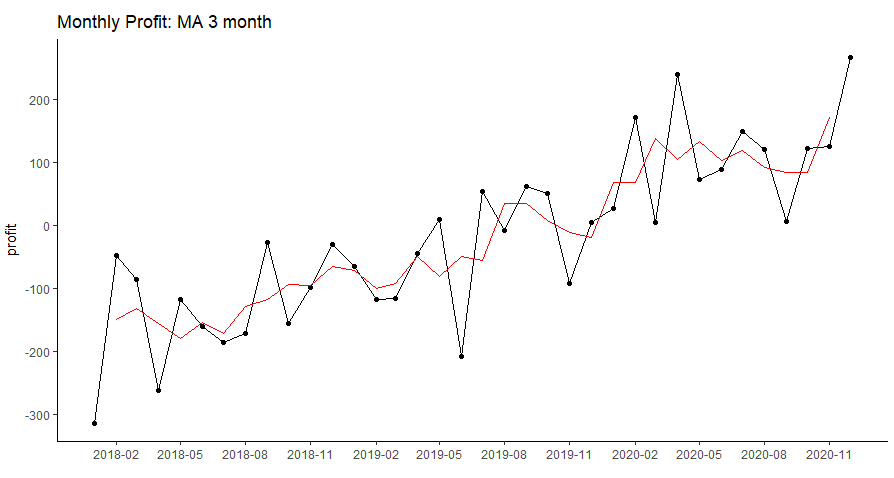
</div>

<a href="./201802/2.moving_average/moving_average_answer.R" target="_blank">정답 보기</a>
</details>

### 3 월
<details><summary>1. path_drawing</summary>
    
<a href="./201803/1.path_drawing/path_drawing_quiz.md" target="_blank">문제 바로 가기</a>

<div>Q) 주어진 데이터를 이용하여 제품군별 고객수 객단가 추이를 그려주세요 :)</div>
    
<div align="center">
  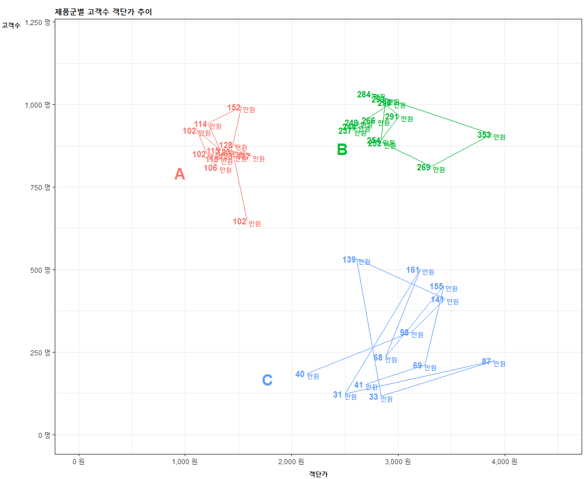
</div>

<a href="./201803/1.path_drawing/path_drawing_answer.R" target="_blank">정답 보기</a>
</details>

<details><summary>2. discretize</summary>
    
<a href="./201803/2.discretize/discretize_quiz.md" target="_blank">문제 바로 가기</a>

<div>Q)</div>
    
<div align="center">
  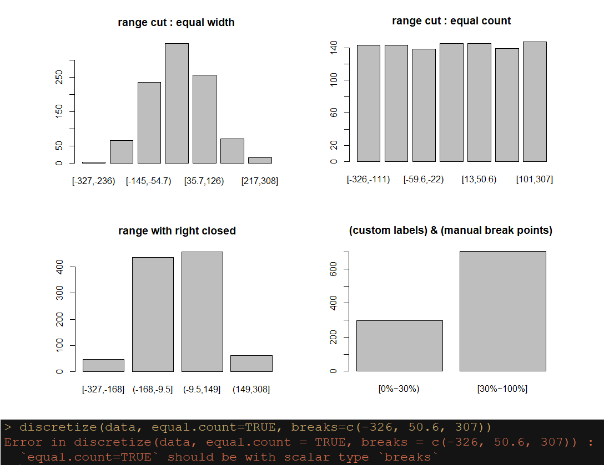
</div>

<a href="./201803/2.discretize/discretize_answer.R" target="_blank">정답 보기</a>
</details>

### 4 월
<details><summary>1. Korea_20180427</summary>
    
<a href="./201804/1.Korea_20180427/Korea_20180427_quiz.md" target="_blank">문제 바로 가기</a>

<div>Q) 통일한국은 과연 우리의 미래가 될 수 있을까요?</div>
    
<div align="center">
  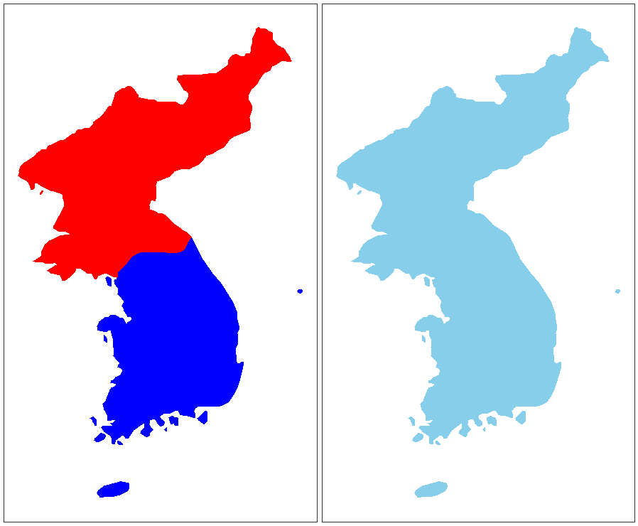
</div>

<a href="./201804/1.Korea_20180427/Korea_20180427_answer.R" target="_blank">정답 보기</a>
</details>

### 6 월
<details><summary>1. PieDonut</summary>
    
<a href="./201806/1.PieDonut/PieDonut_quiz.md" target="_blank">문제 바로 가기</a>

<div>---</div>
    
<div align="center">
  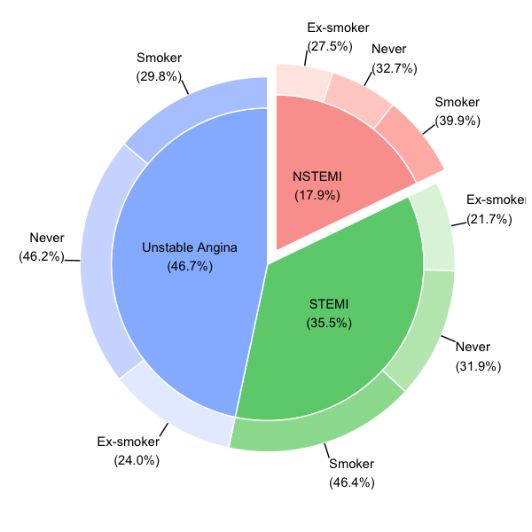
</div>

<a href="./201806/1.PieDonut/PieDonut_answer.Rmd" target="_blank">정답 보기</a>
</details>

<details><summary>2. Ribbons</summary>
    
<a href="./201806/2.Ribbons/Ribbons_quiz.md" target="_blank">문제 바로 가기</a>

<div>Q) geom_polygon, geom_ribbon, geom_area, geom_path 를 이용하여 4개의 리본을 그려주세요!</div>
    
<div align="center">
  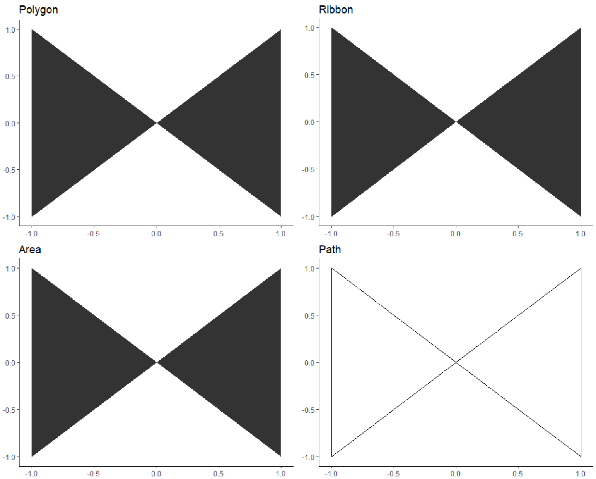
</div>

<a href="./201806/2.Ribbons/Ribbons_answer.R" target="_blank">정답 보기</a>
</details>

### 8 월
<details><summary>1. movie_similarity</summary>
    
<a href="./201808/1.movie_similarity/movie_similarity_quiz.md" target="_blank">문제 바로 가기</a>

<div>Q) starwars 시리즈들의 유사도를 등장인물들의 자카드 유사도를 통해 첨부 차트와 같이 표현해주세요...!</div>
    
<div align="center">
  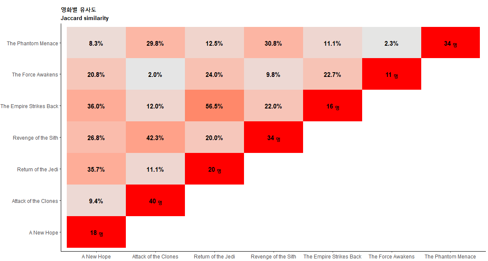
</div>

<a href="./201808/1.movie_similarity/movie_similarity_answer.R" target="_blank">정답 보기</a>
</details>

### 10 월
<details><summary>1. flatrate</summary>
    
<a href="./201810/1.flatrate/flatrate_quiz.md" target="_blank">문제 바로 가기</a>

<div>Q) 사용자별 이용권 시작일 ~ 종료일 정보를 이용하여 다음과 같은 차트를 그려주세요...!</div>
    
<div align="center">
  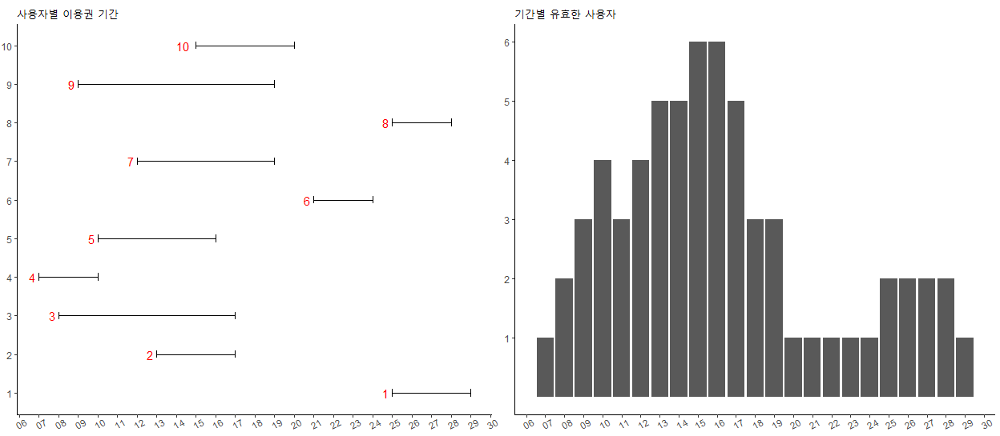
</div>

<a href="./201810/1.flatrate/flatrate_answer.R" target="_blank">정답 보기</a>
</details>

### 11 월
<details><summary>1. address_cleaning</summary>
    
<a href="./201811/1.address_cleaning/address_cleaning_quiz.md" target="_blank">문제 바로 가기</a>

<div>Q) 주어진 데이터를 행정단위 '동' 상위 행정단위만 남겨주세요...!</div>
    
<div align="center">
  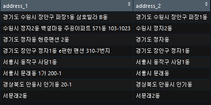
</div>

<a href="./201811/1.address_cleaning/address_cleaning_answer.R" target="_blank">정답 보기</a>
</details>

## 2019 년
### 11 월
<details><summary>1. find_abuser</summary>
    
<a href="./201911/1.find_abuser/find_abuser_quiz.md" target="_blank">문제 바로 가기</a>

<div>Q) 어뷰저를 찾기 위한 블랙리스트 함수를 작성해주세요</div>
    
<div align="center">
  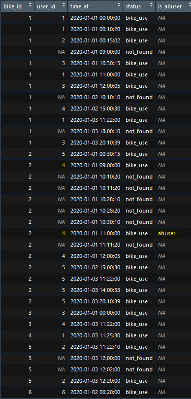
</div>

<a href="./201911/1.find_abuser/find_abuser_answer.R" target="_blank">정답 보기</a>
</details>

### 12 월
<details><summary>1. woodring</summary>
    
<a href="./201912/1.woodring/woodring_quiz.md" target="_blank">문제 바로 가기</a>

<div>Q) 첨부 그림과 같은 나이테 차트를 그려주세요!</div>
    
<div align="center">
  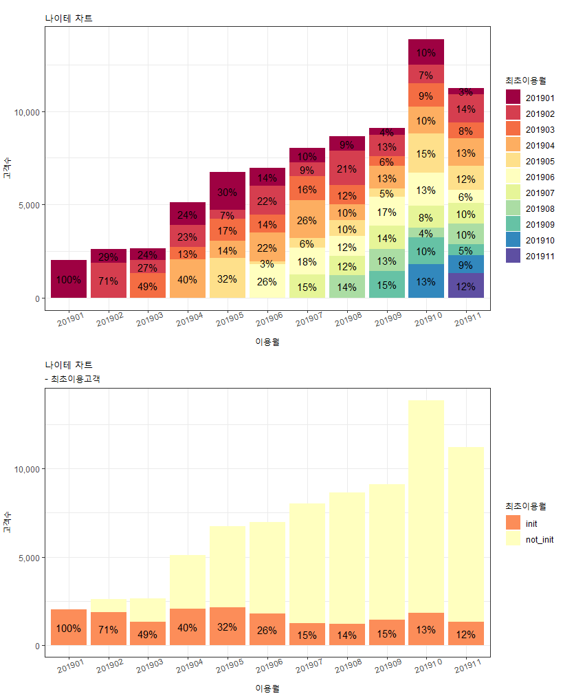
</div>

<a href="./201912/1.woodring/woodring_answer.R" target="_blank">정답 보기</a>
</details>

<details><summary>2. inequality</summary>
    
<a href="./201912/2.inequality/inequality_quiz.md" target="_blank">문제 바로 가기</a>

<div>Q) 주어진 소득(= income.csv) 데이터를 이용하여 소득상위N%가 전체소득에서 차지하는 비중을 차트로 그려주세요!</div>
    
<div align="center">
  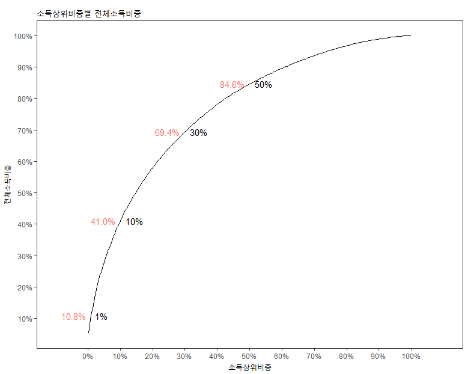
</div>

<a href="./201912/2.inequality/inequality_answer.R" target="_blank">정답 보기</a>
</details>

<details><summary>3. segmentation</summary>
    
<a href="./201912/3.segmentation/segmentation_quiz.md" target="_blank">문제 바로 가기</a>

<div>Q)</div>
    
<div align="center">
  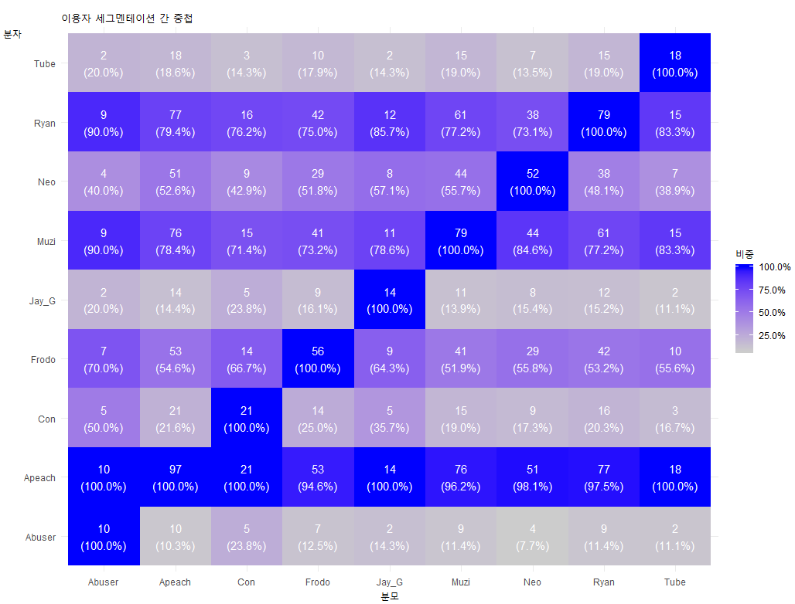
</div>

<a href="./201912/3.segmentation/segmentation_answer.R" target="_blank">정답 보기</a>
</details>

<details><summary>4. sync_plots</summary>
    
<a href="./201912/4.sync_plots/sync_plots_quiz.md" target="_blank">문제 바로 가기</a>

<div>Q) server 함수를 완성하여 plot1에서 드래그(=brush)한 데이터들을 찾아 plot2에서 강조해주는 shiny app을 만들어주세요!</div>
    
<div align="center">
  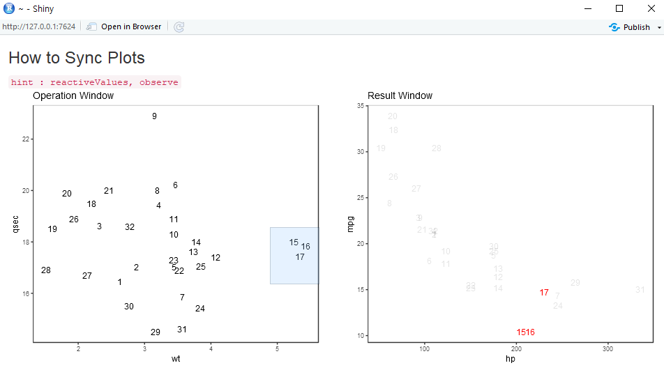
</div>

<a href="./201912/4.sync_plots/sync_plots_answer.R" target="_blank">정답 보기</a>
</details>

## 2020 년
### 1 월
<details><summary>1. sync_table_plot</summary>
    
<a href="./202001/1.sync_table_plot/sync_table_plot_quiz.md" target="_blank">문제 바로 가기</a>

<div>Q) 그림과 같이 datatable과 leaflet plot을 연동한 shiny app을 만들어주세요!</div>
    
<div align="center">
  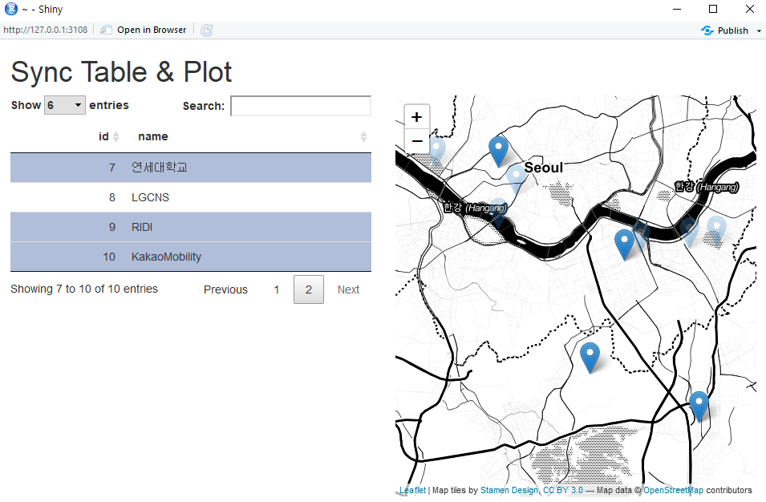
</div>

<a href="./202001/1.sync_table_plot/sync_table_plot_answer.R" target="_blank">정답 보기</a>
</details>

<details><summary>2. points_allocation</summary>
    
<a href="./202001/2.points_allocation/points_allocation_quiz.md" target="_blank">문제 바로 가기</a>

<div>Q) 각 polygon 에 겹치는 point 수를 count 후 첨부 파일과 같이 시각화 해주세요!</div>
    
<div align="center">
  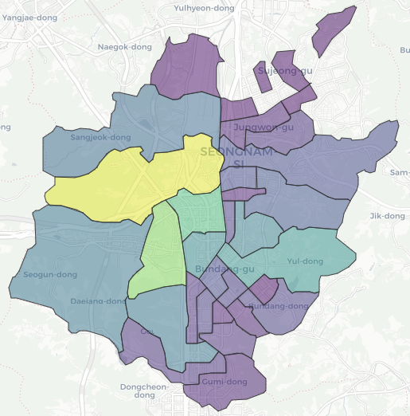
</div>

<a href="./202001/2.points_allocation/points_allocation_answer.R" target="_blank">정답 보기</a>
</details>

<details><summary>3. leaflet_etude</summary>
    
<a href="./202001/3.leaflet_etude/leaflet_etude_quiz.md" target="_blank">문제 바로 가기</a>

<div>Q) 임의의 sf polygon object 를 넘기면 chart를 그려주는 함수 pretty.view 를 작성해주세요!</div>
    
<div align="center">
  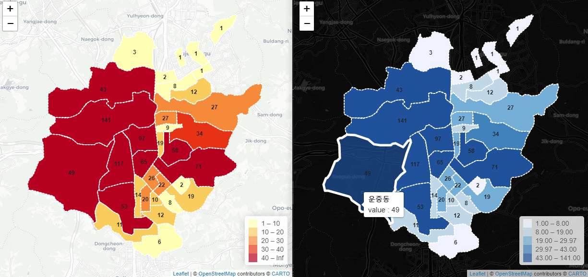
</div>

<a href="./202001/3.leaflet_etude/leaflet_etude_answer.R" target="_blank">정답 보기</a>
</details>

<details><summary>4. interactive_map</summary>
    
<a href="./202001/4.interactive_map/interactive_map_quiz.md" target="_blank">문제 바로 가기</a>

<div>Q) 다음 그림과 같은 매출 시뮬레이터를 만들어 주세요</div>
    
<div align="center">
  
</div>

<a href="./202001/4.interactive_map/interactive_map_answer.R" target="_blank">정답 보기</a>
</details>

### 2 월
<details><summary>1. union_hcode</summary>
    
<a href="./202002/1.union_hcode/union_hcode_quiz.md" target="_blank">문제 바로 가기</a>

<div>Q) 주어진 data의 hcode 앞 N자리(=digit)를 key로 삼아 polygon들을 합쳐주는 함수 union_hcode를 완성해주세요!</div>
    
<div align="center">
  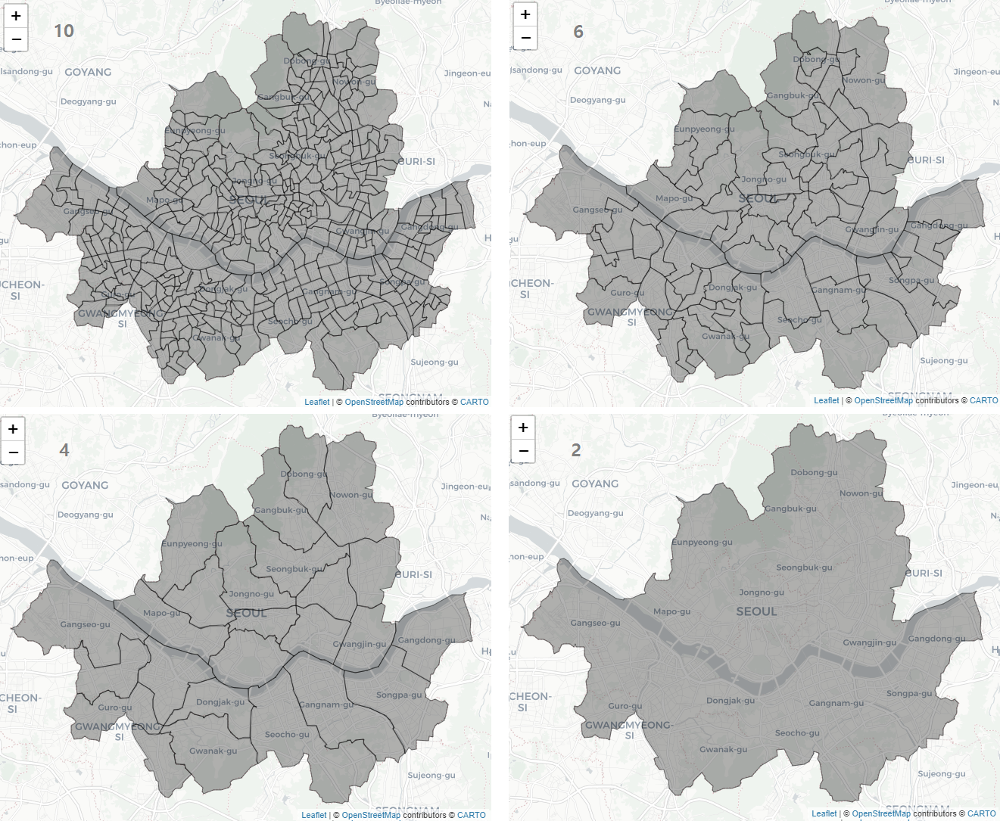
</div>

<a href="./202002/1.union_hcode/union_hcode_answer.R" target="_blank">정답 보기</a>
</details>

<details><summary>2. fill_h3</summary>
    
<a href="./202002/2.fill_h3/fill_h3_quiz.md" target="_blank">문제 바로 가기</a>

<div>Q) 입력 받은 points 와 polygon 의 겹치는 부분을 H3 hexagons 으로 채워주는 함수 fill_h3 를 만들어주세요!</div>
    
<div align="center">
  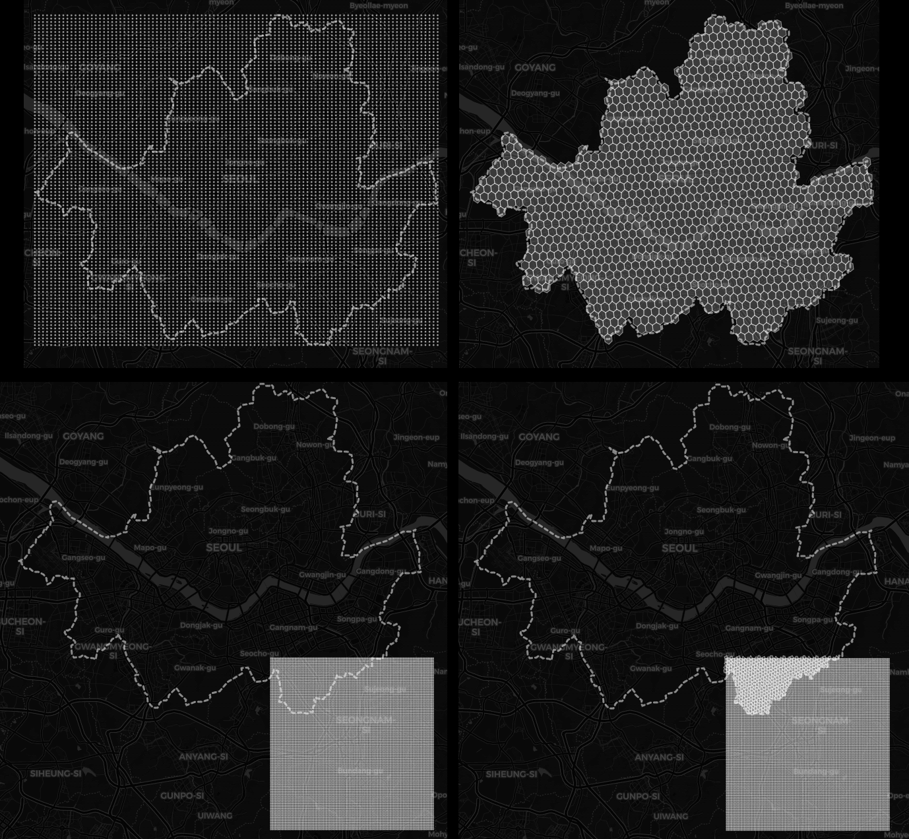
</div>

<a href="./202002/2.fill_h3/fill_h3_answer.R" target="_blank">정답 보기</a>
</details>

<details><summary>3. shrinkage_methods</summary>
    
<a href="./202002/3.shrinkage_methods/shrinkage_methods_quiz.md" target="_blank">문제 바로 가기</a>

<div>Q) 주어진 formula 와 data 를 가공해 다음과 같은 차트를 그릴 수 있도록 코드를 작성해주세요!</div>
    
<div align="center">
  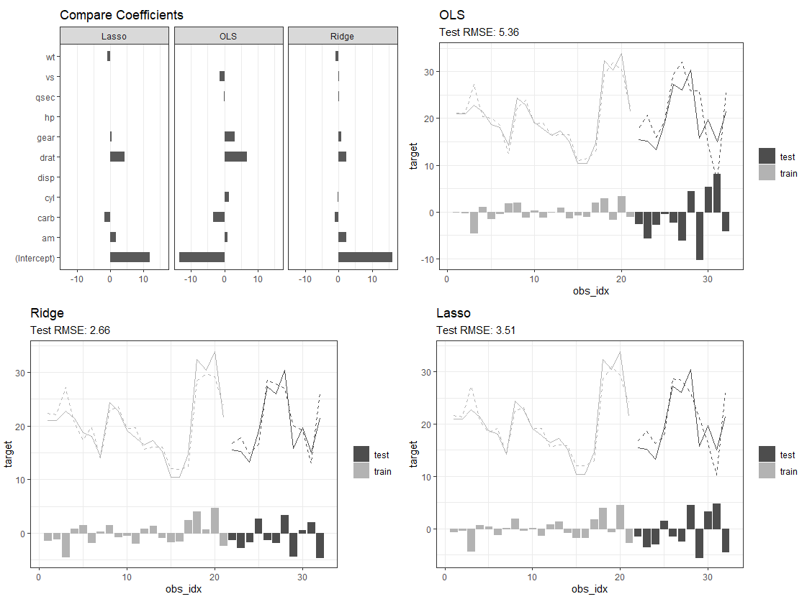
</div>

<a href="./202002/3.shrinkage_methods/shrinkage_methods_answer.R" target="_blank">정답 보기</a>
</details>

<details><summary>4. district_maker</summary>
    
<a href="./202002/4.district_maker/district_maker_quiz.md" target="_blank">문제 바로 가기</a>

<div>Q) 임의의 구역을 그리고 저장할 수 있는 샤이니 앱을 작성해주세요!</div>
    
<div align="center">
  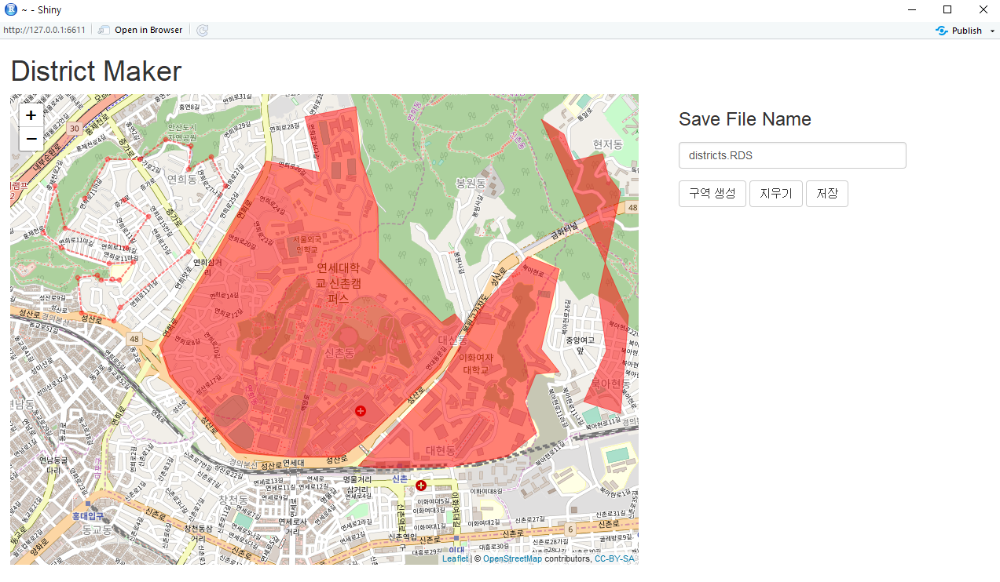
</div>

<a href="./202002/4.district_maker/district_maker_answer.R" target="_blank">정답 보기</a>
</details>

### 3 월
<details><summary>1. geo_network</summary>
    
<a href="./202003/1.geo_network/geo_network_quiz.md" target="_blank">문제 바로 가기</a>

<div>Q) 지리정보를 기반으로 네트워크를 그려주는 함수 point.network 와 h3.network 를 작성해주세요!</div>
    
<div align="center">
  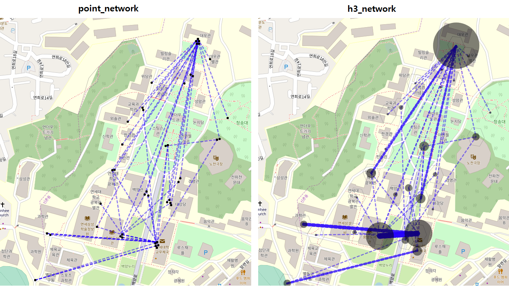
</div>

<a href="./202003/1.geo_network/geo_network_answer.R" target="_blank">정답 보기</a>
</details>

### 4 월
<details><summary>1. o2o_event_simulation</summary>
    
<a href="./202004/1.o2o_event_simulation/o2o_event_simulation_quiz.md" target="_blank">문제 바로 가기</a>

<div>Q) O2O(=Online to Offline) 이벤트 참여율을 시뮬레이션하는 샤이니 앱을 작성해주세요!</div>
    
<div align="center">
  
</div>

<a href="./202004/1.o2o_event_simulation/o2o_event_simulation_answer.R" target="_blank">정답 보기</a>
</details>

### 5 월
<details><summary>1. hcode_h3_mapping</summary>
    
<a href="./202005/1.hcode_h3_mapping/hcode_h3_mapping_quiz.md" target="_blank">문제 바로 가기</a>

<div>Q) 주어진 행정동 지역과 H3 polygon을 맵핑해주세요!</div>
    
<div align="center">
  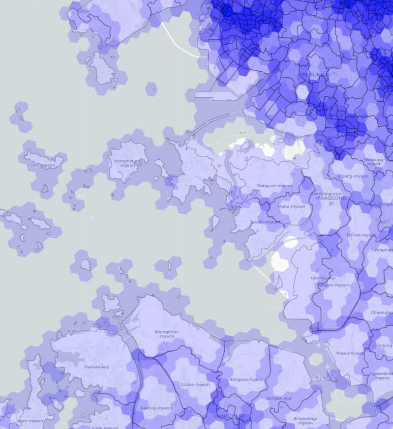
</div>

<a href="./202005/1.hcode_h3_mapping/hcode_h3_mapping_answer.R" target="_blank">정답 보기</a>
</details>

<details><summary>2. waffle_chart</summary>
    
<a href="./202005/2.waffle_chart/waffle_chart_quiz.md" target="_blank">문제 바로 가기</a>

<div>Q) Waffle Chart 를 그려봅시다!</div>
    
<div align="center">
  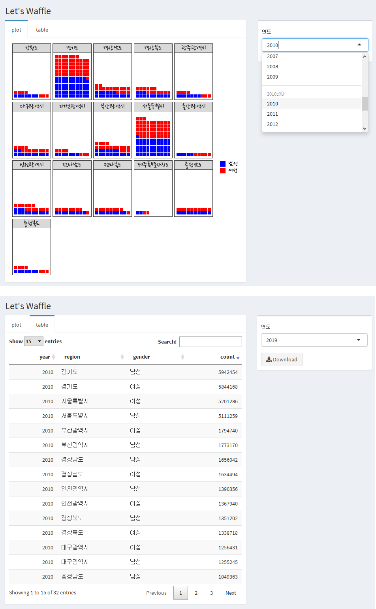
</div>

<a href="./202005/2.waffle_chart/waffle_chart_answer.R" target="_blank">정답 보기</a>
</details>

### 7 월
<details><summary>1. event_areas</summary>
    
<a href="./202007/1.event_areas/event_areas_quiz.md" target="_blank">문제 바로 가기</a>

<div>Q) 이벤트 구역 내에서 발생한 이벤트 수를 집계해주는 함수 daily_matched_points 를 구현해주세요!</div>
    
<div align="center">
  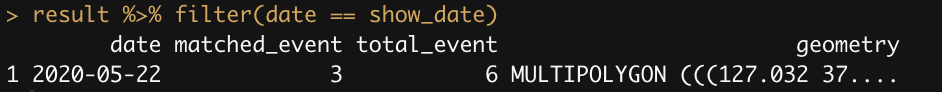
</div>

<a href="./202007/1.event_areas/event_areas_answer.R" target="_blank">정답 보기</a>
</details>

<details><summary>2. infection_simulation</summary>
    
<a href="./202007/2.infection_simulation/infection_simulation_quiz.md" target="_blank">문제 바로 가기</a>

<div>Q) 사회 구성원들의 움직임에 따른 감염 시뮬레이션을 만들어주세요!</div>
    
<div align="center">
  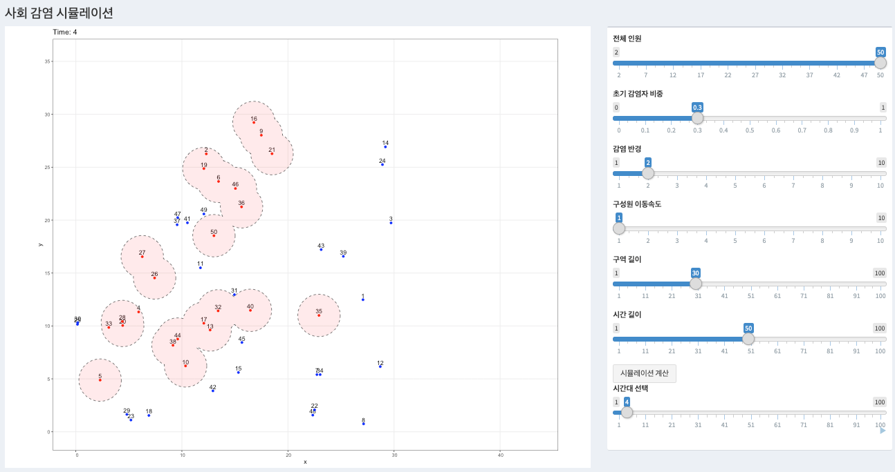
</div>

<a href="./202007/2.infection_simulation/infection_simulation_answer.R" target="_blank">정답 보기</a>
</details>

### 8 월
<details><summary>1. colour_etude</summary>
    
<a href="./202008/1.colour_etude/colour_etude_quiz.md" target="_blank">문제 바로 가기</a>

<div>Q) 예전에 만들었던 이용자 세그먼트 교차비중 차트를 수정해달라는 요청이 들어왔습니다!</div>
    
<div align="center">
  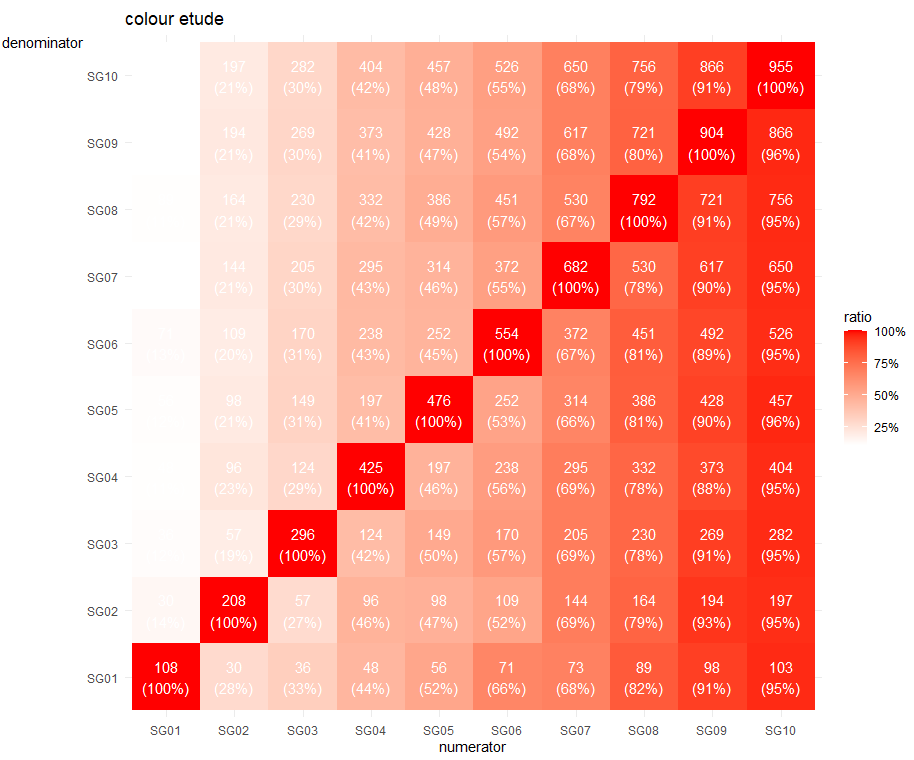
</div>

<a href="./202008/1.colour_etude/colour_etude_answer.R" target="_blank">정답 보기</a>
</details>

### 10 월
<details><summary>1. deadlines</summary>
    
<a href="./202010/1.deadlines/deadlines_quiz.md" target="_blank">문제 바로 가기</a>

<div>Q) 주어진 위경도 (lat, lon) 좌표 및 반경 (radius, meter 단위) 안쪽에 위치하는 선들을 체크하는 함수 dead.line.check 를 만들어주세요!</div>
    
<div align="center">
  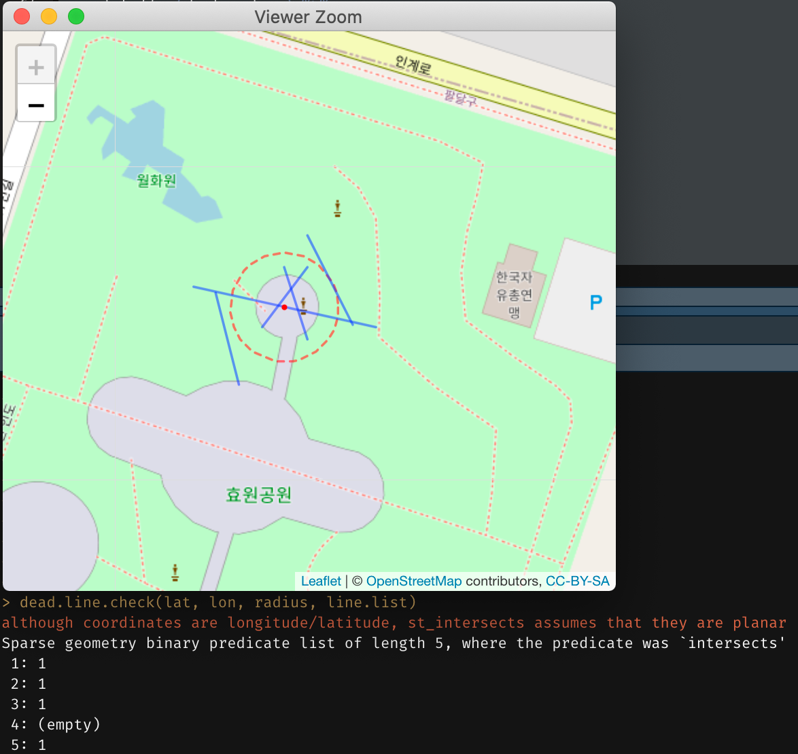
</div>

<a href="./202010/1.deadlines/deadlines_answer.R" target="_blank">정답 보기</a>
</details>

### 11 월
<details><summary>1. bi_etude</summary>
    
<a href="./202011/1.bi_etude/bi_etude_quiz.md" target="_blank">문제 바로 가기</a>

<div>Q) 실전에서 사용가능한 GIS 기반 BI 툴 한번 만들어봅시다!</div>
    
<div align="center">
  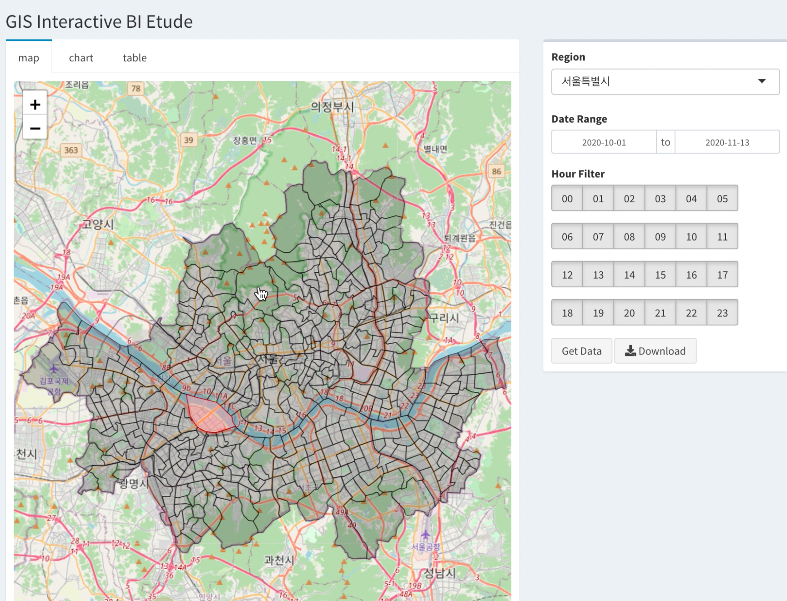
</div>

<a href="./202011/1.bi_etude/bi_etude_answer.R" target="_blank">정답 보기</a>
</details>

### 12 월
<details><summary>1. quick_linear_modeler</summary>
    
<a href="./202012/1.quick_linear_modeler/quick_linear_modeler_quiz.md" target="_blank">문제 바로 가기</a>

<div>Q) 간단한 선형모델들을 빠르게 탐색해볼 수 있는 샤이니 앱을 만들어주세요!</div>
    
<div align="center">
  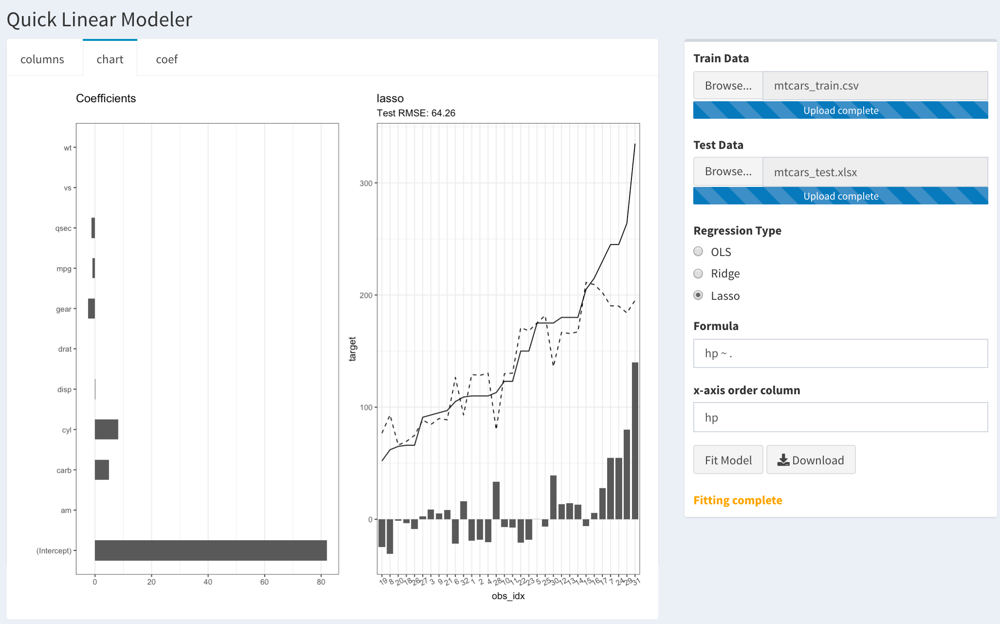
</div>

<a href="./202012/1.quick_linear_modeler/quick_linear_modeler_answer.R" target="_blank">정답 보기</a>
</details>

## 2021 년
### 3 월
<details><summary>1. summarise_commons</summary>
    
<a href="./202103/1.summarise_commons/summarise_commons_quiz.md" target="_blank">문제 바로 가기</a>

<div>Q) 주어진 서울시 동 단위 행정구역 폴리곤을 구 단위로 묶으려합니다.</div>
    
<div align="center">
  
</div>

<a href="./202103/1.summarise_commons/summarise_commons_answer.R" target="_blank">정답 보기</a>
</details>

### 4 월
<details><summary>1. career_salary</summary>
    
<a href="./202104/1.career_salary/career_salary_quiz.md" target="_blank">문제 바로 가기</a>

<div>Q) 주어진 연봉테이블 기준으로 테이블을 콘솔 출력하고 차트를 그려주는 함수 career_salary_graph 를 작성해주세요!</div>
    
<div align="center">
  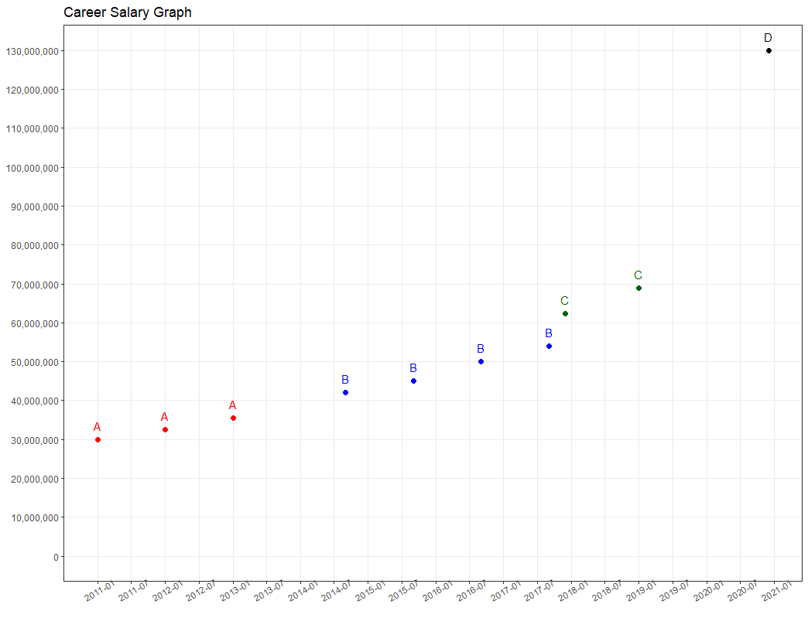
</div>

<a href="./202104/1.career_salary/career_salary_answer.R" target="_blank">정답 보기</a>
</details>

### 9 월
<details><summary>1. unnest_json_col</summary>
    
<a href="./202109/1.unnest_json_col/unnest_json_col_quiz.md" target="_blank">문제 바로 가기</a>

<div>Q) 주어진 json 컬럼을 풀어 data.frame 으로 이어붙여주는 함수 unnest_json_col 함수를 만들어주세요!</div>
    

</details>


## NOTES
이 파일은 2021-09-29 22:14:19 (Asia/Seoul) 자동으로 생성되었습니다.

## 생성 방법
### Python

```shell
pipenv install # install dependencies
pipenv run python utils/print_markdown.py
```

